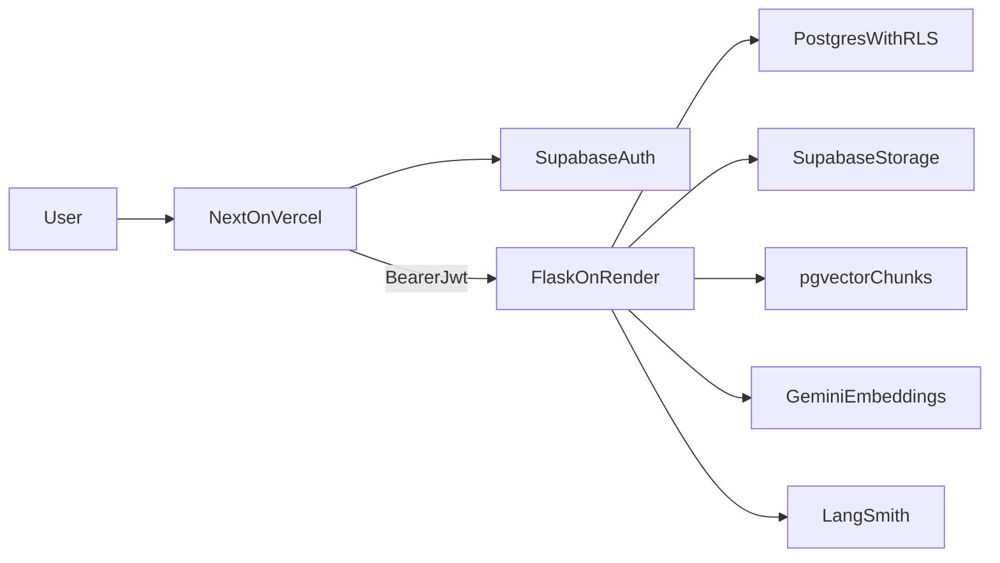

# Contrato del sistema (Fase 0) — workyAI

Este documento fija el contrato técnico y operativo del producto antes de implementar código de dominio. Sirve como referencia única para decisiones de arquitectura, seguridad, RAG v1 y operación en producción única (cloud-only).

---

## 1. Glosario

| Término | Definición |
|--------|------------|
| **Tenant** | Unidad de aislamiento lógico de datos y permisos (por ejemplo una organización o espacio de trabajo). Los datos y políticas deben estar acotados al tenant correspondiente. |
| **Tenant activo** | El tenant seleccionado en la sesión o contexto de la aplicación para la que se evalúan permisos y se ejecutan consultas. Debe derivarse de claims o membresías verificables, no de entradas no confiables del cliente sin validación. |
| **Membership** | Relación entre un usuario autenticado y un tenant: indica que el usuario pertenece a ese tenant y habilita roles dentro de él. |
| **Roles (owner / admin / editor / viewer)** | Jerarquía de autorización sobre recursos del tenant. **Owner**: control total del tenant (incluye gestión de miembros y configuración crítica). **Admin**: administración operativa sin necesariamente transferencia de propiedad. **Editor**: creación y modificación de contenido autorizado. **Viewer**: solo lectura de lo permitido por política. Los nombres exactos en base de datos pueden variar, pero la semántica se mantiene. |
| **JWT (usuario)** | Token emitido por Supabase Auth para el usuario final. Contiene `sub`, claims estándar y claims de app acordados; se envía al backend Flask como **Bearer** para que Flask valide identidad y derive autorización. |
| **service_role** | Clave o rol con privilegios elevados en Supabase (bypass de RLS cuando se usa el cliente con esa clave). Solo para procesos de confianza en el servidor; **nunca** en el navegador ni en variables `NEXT_PUBLIC_*`. |
| **Documento** | Entidad de negocio que representa un archivo o contenido indexable (metadatos en Postgres, referencia a origen). |
| **Storage** | Almacenamiento de objetos (Supabase Storage) donde residen los binarios o archivos fuente asociados a documentos. |
| **Chunk RAG** | Fragmento de texto derivado del documento (por ejemplo por encabezados Markdown), vectorizado y almacenado para recuperación semántica. |
| **index_status: pending** | El documento está en cola o en proceso de indexación; la búsqueda RAG puede excluirlo o marcarlo como no listo según producto. |
| **index_status: ready** | Indexación completada correctamente; los chunks y embeddings están disponibles para consulta. |
| **index_status: failed** | Falló la indexación o el embedding; el documento permanece visible con error explícito (sin truncar silenciosamente el fallo por defecto). |
| **Correlación LangSmith vs agent_runs / agent_steps** | **LangSmith** aporta trazas y observabilidad de ejecución del agente (runs, spans). En aplicación, **agent_runs** y **agent_steps** son registros persistidos que deben poder correlacionarse con IDs o metadatos de traza LangSmith para depuración y auditoría entre lo observado en la nube y lo almacenado en Postgres. Los spans hijos del grafo (retrieve, rewrite, generate, etc.) cuelgan del run raíz publicado por el chat cuando el tracing está activo. |
| **audit_events** | Tabla append-only de eventos de producto (p. ej. chat completado, documento subido, cambios de IA por tenant). Solo el API con **service_role** inserta filas; los usuarios **owner/admin** pueden listar vía RLS en Postgres o vía endpoint Flask con el mismo criterio de rol. |
| **in_app_notifications** | Notificaciones dirigidas a un **usuario** dentro de un **tenant** (`user_id` + `tenant_id`). Solo Flask con **service_role** inserta; el destinatario miembro del tenant puede **SELECT** y **UPDATE** (p. ej. `read_at`) vía RLS; el cliente Next puede suscribirse a **Realtime** (`postgres_changes`) para inserts/updates. |

---

## 2. Arquitectura

Flujo principal de solicitudes y dependencias externas:

- **User → Next (Vercel) → Supabase Auth**: el usuario interactúa con la aplicación Next.js desplegada en Vercel; la autenticación se delega a Supabase Auth (sesión / JWT según el flujo elegido).
- **Next → Flask (Render) con Bearer JWT**: las operaciones que requieren lógica de agente, RAG o privilegios de servidor invocan la API Flask en Render enviando el JWT del usuario (o un flujo equivalente acordado) para validación.
- **Flask → Postgres/RLS, Storage, chunks en pgvector, embeddings Gemini, LangSmith**: Flask es el orquestador de negocio; persiste y consulta datos con RLS donde aplique, lee/escribe Storage, gestiona chunks vectoriales en pgvector, llama a **Gemini** para embeddings y registra trazas en **LangSmith**.

---

## 3. Modelo de amenazas mínimo

1. **Secretos y variables públicas**  
   No exponer secretos mediante `NEXT_PUBLIC_*`. Todo secreto debe permanecer solo en entornos de servidor (Vercel server, Render, funciones seguras) y en Supabase como claves de servicio restringidas.

2. **Validación de JWT**  
   Validar firmas contra **JWKS** del proveedor, y comprobar de forma estricta **`iss`**, **`aud`** y **`exp`** (y otros claims acordados). La configuración incorrecta de audiencia o emisor es vector de tokens aceptados indebidamente. Referencia oficial: [JSON Web Tokens (JWT) en Supabase](https://supabase.com/docs/guides/auth/jwts).

3. **service_role y autorización en Flask**  
   Aunque el backend use `service_role` para operaciones técnicas, **Flask debe aplicar autorización explícita** (tenant, rol, recurso). El rol de servicio no sustituye la comprobación de permisos de negocio: un error aquí expone todos los datos bajo RLS.

4. **Permisos fuera de `user_metadata`**  
   No almacenar ni confiar en permisores o roles solo en `user_metadata` editable por rutas no controladas. Los permisos efectivos deben basarse en membresías y roles persistidos y verificados del lado servidor, alineados con la documentación de claims y buenas prácticas de Supabase Auth.

---

## 4. Decisiones RAG v1

| Área | Decisión |
|------|----------|
| **Chunking** | Por encabezados Markdown: los fragmentos respetan la estructura del documento para mejorar coherencia contextual en recuperación. |
| **Idioma del contenido** | Contenido orientado a **español** (consultas y corpus principal en español salvo excepciones de producto documentadas). |
| **Embeddings** | Modelo **gemini-embedding-001**, vectores de **1536** dimensiones almacenados en **pgvector**. |
| **Indexación** | **S1**: sincronización en el flujo de solicitud (sin cola asíncrona obligatoria en v1). Detalle operativo: `docs/operations/04-phase4-rag-pgvector.md`. |
| **Fallo de embedding** | Mantener el archivo/documento visible con **`index_status = failed`**, mensaje de error claro para el usuario u operador. **Sin truncado silencioso** por defecto que oculte el fallo. |
| **Desbordamiento de tokens** | Si el contenido excede límites del modelo de embedding, marcar como **failed** con mensaje explícito (no intentar “recortar” sin dejar constancia ni consentimiento de política). |

---

## 5. Operación: solo producción, cloud-only

- **Cambios pequeños y despliegues frecuentes**: reducir el tamaño del diff por release para aislar fallos y acelerar rollback mental.
- **Diagnóstico por logs y CLI**: priorizar trazas estructuradas, correlación con LangSmith y herramientas de línea de comandos (Vercel CLI, Render, Supabase) en lugar de entornos adicionales no mantenidos.
- **Sin staging dedicado**: se asume un solo entorno productivo gestionado; el riesgo de deriva entre entornos se mitiga con pruebas locales mínimas y revisiones acotadas.
- **SQL correctivo limitado**: scripts ad hoc solo cuando sea inevitable, con backup previo si la operación es destructiva.
- **Backups en free tier**: acotar expectativas de retención y RPO/RTO; documentar qué cubre el proveedor y qué no.
- **Fase 7 (agente + auditoría)**: grafo LangGraph con routing condicional (reescritura y hasta dos recuperaciones), `agent_steps` por `step_index` único por run, spans LangSmith hijos bajo la traza raíz, tabla **`audit_events`** append-only y listado para **owner/admin**; ver `docs/operations/07-phase7-langgraph-audit.md`.
- **Fase 8 (notificaciones in-app + Realtime)**: tabla **`in_app_notifications`**, RLS por destinatario y membresía, inserción solo desde Flask; campana en Next con `postgres_changes`; ver `docs/operations/08-phase8-in-app-notifications-realtime.md`.

---

## 6. Definition of Done (DoD) y secretos

### 6.1 Checklist DoD (Fase 0 → arranque de implementación)

- [ ] Glosario y flujo arquitectónico revisados por quien implementa backend y frontend.
- [ ] Variables de entorno inventariadas; ningún secreto en `NEXT_PUBLIC_*`.
- [ ] Estrategia de validación JWT (JWKS, `iss`, `aud`, `exp`) acordada para Flask.
- [ ] Reglas de autorización por tenant y rol definidas a nivel conceptual (sin exigir SQL completo en este contrato).
- [ ] Contrato RAG v1 (chunking, dimensiones, estados de indexación) alineado con el equipo.
- [ ] Plan de observabilidad mínimo: LangSmith + tablas `agent_runs` / `agent_steps` con correlación definida.

### 6.2 Tabla comparativa de secretos (orientativa)

| Secreto / credencial | Vercel (Next) | Render (Flask) | Supabase |
|---------------------|---------------|----------------|----------|
| URL del proyecto Supabase | Server-only | Sí | N/A (es el propio proyecto) |
| Clave anónima (anon) | Solo si el cliente la necesita; nunca para bypass RLS sensible | Opcional según diseño | Publicable con RLS estricta |
| **service_role** | **No** en cliente | Sí, solo servidor Flask aislado | Origen de la clave |
| JWT signing / JWKS | N/A (validación en Flask) | Validación con JWKS de Supabase | Emisor de JWT |
| API key Gemini | Server-only en Next si hubiera llamada directa | Sí: global `GEMINI_API_KEY` y/o por tenant cifrada en `tenant_ai_settings` (Fernet `TENANT_SECRETS_FERNET_KEY`) | N/A (tabla sin acceso `authenticated`; solo Flask con `service_role`) |
| LangSmith API key | Server-only si aplica desde Next | Sí en Flask | N/A |
| Secretos de sesión / cookies | Config server | N/A o mínimo | Auth helpers |

*Nota*: La tabla resume responsabilidades; el inventario exacto se completa al crear los servicios.

---

## 7. Riesgos breves

1. **Latencia S1 (indexación síncrona)**  
   La indexación en línea puede aumentar tiempo de respuesta o timeouts bajo archivos grandes o picos de tráfico. Mitigación a corto plazo: límites de tamaño y mensajes claros. **Evolución probable**: cola asíncrona o workers en una fase posterior.

2. **Rotación de clave Gemini**  
   Procedimiento recomendado: añadir la nueva clave en Render (y otros hosts) como variable alternativa, desplegar, verificar generación de embeddings en un documento de prueba, sustituir la clave antigua y revocarla en la consola de Google AI. Mantener ventana de solapamiento mínima documentada en runbook interno.

---

## Fuera de alcance de este documento

- No se incluye **SQL completo** ni políticas **RLS** detalladas (solo principios y referencias).
- No se fijan **versiones exactas de LangGraph** ni del stack de agentes; se acoplarán en la fase de implementación con pin semver en el repositorio.
